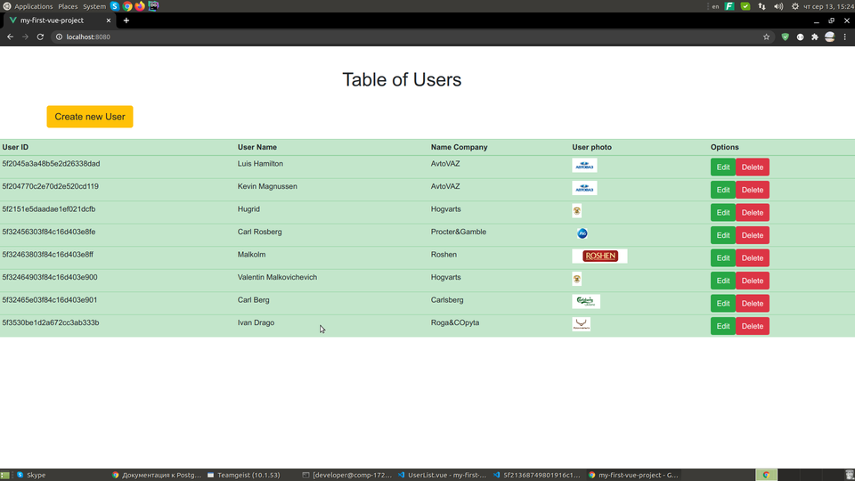
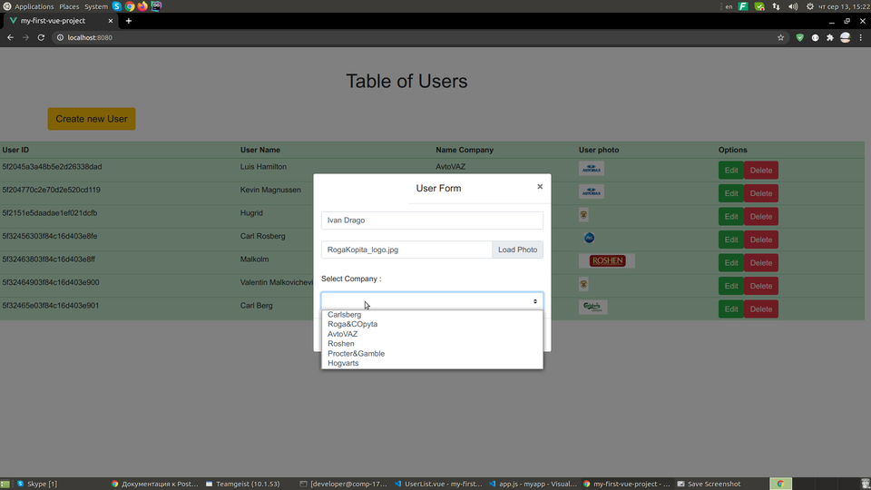
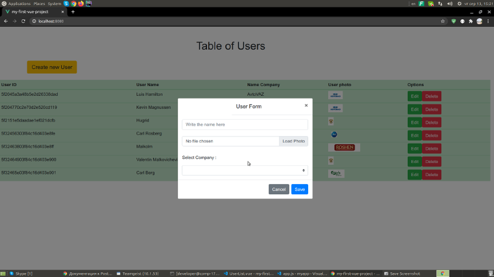

# userTable 
Simple application for administrator or else. Have a one page - user list, and one modal window - userform. Possible Create, edit exists user record or delete it. Also you can load(or update) a user photo.
I used : Node.js+Express,Vue+Bootstrap, Mongoose+MongoDB, Axios. 
<p>



</p>

## Project setup
```
npm install
```

### Compiles and hot-reloads for development
```
npm run serve
```


